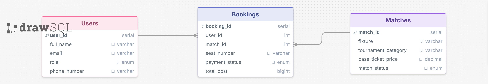

# ⚽ Football Ticket Booking System - Database Design & SQL Queries

## 📖 Project Overview

This project is a solution to **B7-Assignment-03: Football Ticket Booking System - Database Design & SQL Queries**.

The assignment focuses on designing a relational database system for managing football ticket bookings. It demonstrates the implementation of:

- Database schema design
- Primary Key and Foreign Key relationships
- Data integrity using constraints
- SQL querying techniques
- JOIN operations
- Subqueries
- Aggregation functions
- NULL handling
- Pagination using `LIMIT` and `OFFSET`

The database consists of three main entities:

1. **Users** – Stores football fans and ticket managers.
2. **Matches** – Stores football match information.
3. **Bookings** – Stores ticket booking transactions.

---

## 🔗 Live Links

### ERD Diagram

👉 **ERD Link:**
[Football Ticket Booking System ERD](https://drawsql.app/teams/md-sabur/diagrams/b7a3)

### GitHub Repository

👉 **Repository Link:**
[Football Ticket Booking System](https://github.com/gitbugd20p/PH-L2B7-Assignment-03)

### Interview Video

👉 **Video Link:**
[INTERVIEW_VIDEO_LINK](https://drive.google.com/drive/folders/1KQNONTUCTDAxnImwMwIZpTsyYYpvb91S?usp=sharing)

---

# 🗂️ Entity Relationship Diagram (ERD)



---

# 🛠 Database Schema

## Users Table

| Column       | Data Type    | Constraints      |
| ------------ | ------------ | ---------------- |
| user_id      | SERIAL       | PRIMARY KEY      |
| full_name    | VARCHAR(101) | NOT NULL         |
| email        | VARCHAR(101) | UNIQUE, NOT NULL |
| role         | VARCHAR(25)  | CHECK Constraint |
| phone_number | VARCHAR(25)  | NULL Allowed     |

---

## Matches Table

| Column              | Data Type     | Constraints      |
| ------------------- | ------------- | ---------------- |
| match_id            | SERIAL        | PRIMARY KEY      |
| fixture             | VARCHAR(101)  | NOT NULL         |
| tournament_category | VARCHAR(101)  | NOT NULL         |
| base_ticket_price   | DECIMAL(10,2) | CHECK ≥ 0        |
| match_status        | VARCHAR(25)   | CHECK Constraint |

---

## Bookings Table

| Column         | Data Type     | Constraints      |
| -------------- | ------------- | ---------------- |
| booking_id     | SERIAL        | PRIMARY KEY      |
| user_id        | INT           | FOREIGN KEY      |
| match_id       | INT           | FOREIGN KEY      |
| seat_number    | VARCHAR(25)   | NULL Allowed     |
| payment_status | VARCHAR(25)   | CHECK Constraint |
| total_cost     | DECIMAL(10,2) | CHECK ≥ 0        |

---

# 📌 SQL Queries & Solutions

## Query 1

### Retrieve all upcoming football matches belonging to the Champions League where the match status is Available.

```sql
select
  match_id,
  fixture,
  base_ticket_price
from matches
where
  tournament_category = 'Champions League'
  and match_status = 'Available';
```

### Output

| match_id | fixture                  | base_ticket_price |
| -------- | ------------------------ | ----------------- |
| 101      | Real Madrid vs Barcelona | 150.00            |
| 103      | Bayern Munich vs PSG     | 130.00            |

---

## Query 2

### Search for all users whose full names start with Tanvir or contain the phrase Haque (case-insensitive).

```sql
select
  user_id,
  full_name,
  email
from users
where
  full_name ilike 'Tanvir%'
  or full_name ilike '%Haque%';
```

### Output

| user_id | full_name     | email                                     |
| ------- | ------------- | ----------------------------------------- |
| 1       | Tanvir Rahman | [tanvir@mail.com](mailto:tanvir@mail.com) |
| 2       | Asif Haque    | [asif@mail.com](mailto:asif@mail.com)     |

---

## Query 3

### Retrieve all booking records where the payment status is missing (NULL), replacing the empty result with Action Required.

```sql
select
  booking_id,
  user_id,
  match_id,
  coalesce(payment_status, 'Action Required') as systematic_status
from bookings
where
  payment_status is null;
```

### Output

| booking_id | user_id | match_id | systematic_status |
| ---------- | ------- | -------- | ----------------- |
| 504        | 2       | 101      | Action Required   |

---

## Query 4

### Retrieve match booking details along with the user's full name and the scheduled match fixture teams.

```sql
select
  b.booking_id,
  u.full_name,
  m.fixture,
  b.total_cost
from bookings b
inner join users u
  on b.user_id = u.user_id
inner join matches m
  on b.match_id = m.match_id;
```

### Output

| booking_id | full_name     | fixture                  | total_cost |
| ---------- | ------------- | ------------------------ | ---------- |
| 501        | Tanvir Rahman | Real Madrid vs Barcelona | 150        |
| 502        | Tanvir Rahman | Man City vs Liverpool    | 120        |
| 503        | Asif Haque    | Real Madrid vs Barcelona | 150        |
| 504        | Asif Haque    | Real Madrid vs Barcelona | 150        |
| 505        | Sajjad Rahman | Man City vs Liverpool    | 120        |

---

## Query 5

### Display all users and their booking IDs, including fans who have never purchased a ticket.

```sql
select
  u.user_id,
  u.full_name,
  b.booking_id
from users u
left join bookings b
  on u.user_id = b.user_id;
```

### Output

| user_id | full_name     | booking_id |
| ------- | ------------- | ---------- |
| 1       | Tanvir Rahman | 501        |
| 1       | Tanvir Rahman | 502        |
| 2       | Asif Haque    | 503        |
| 2       | Asif Haque    | 504        |
| 3       | Sajjad Rahman | 505        |
| 4       | Jannat Ara    | NULL       |

---

## Query 6

### Find all ticket bookings where the total cost is greater than the average booking cost.

```sql
select
  booking_id,
  match_id,
  total_cost
from bookings
where total_cost > (
  select avg(total_cost)
from bookings
);
```

### Output

| booking_id | match_id | total_cost |
| ---------- | -------- | ---------- |
| 501        | 101      | 150        |
| 503        | 101      | 150        |
| 504        | 101      | 150        |

---

## Query 7

### Retrieve the top 2 most expensive matches while skipping the highest-priced match.

```sql
select
  match_id,
  fixture,
  base_ticket_price
from matches
order by base_ticket_price desc
limit 2 offset 1;
```

### Output

| match_id | fixture               | base_ticket_price |
| -------- | --------------------- | ----------------- |
| 103      | Bayern Munich vs PSG  | 130               |
| 102      | Man City vs Liverpool | 120               |

---

# 🧠 SQL Concepts Demonstrated

This assignment covers the following SQL concepts:

- DDL (CREATE TABLE)
- Constraints
    - PRIMARY KEY
    - FOREIGN KEY
    - UNIQUE
    - CHECK

- Data Seeding
- Filtering with WHERE
- Pattern Matching (`LIKE`, `ILIKE`)
- NULL Handling (`COALESCE`)
- INNER JOIN
- LEFT JOIN
- Aggregate Functions (`AVG`)
- Subqueries
- Pagination (`LIMIT`, `OFFSET`)

---

# 👨‍💻 Author

**Md. Sabur**

GitHub: [gitbugd20p](https://github.com/gitbugd20p)

---

# 📄 License

This project was developed for educational purposes as part of the Programming Hero Level-2 Web Development Course.

Feel free to use this repository for learning and reference purposes.

---

## ⭐ Acknowledgement

Special thanks to Programming Hero for designing practical database assignments that help strengthen SQL and database design skills.

---
